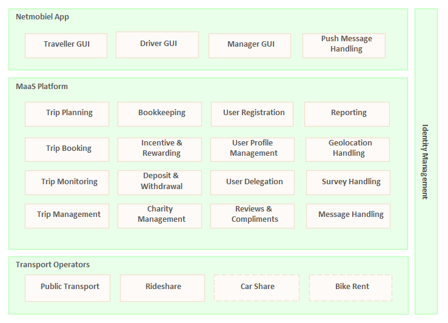

# netmobiel-platform

`Netmobiel Platform` is the backend of the NetMobiel Mobility-As-A-Service system. The backend is written as a Java Enterprise application and packaged as an EAR. 

The Netmobiel Project (also named Netmobil) is a Dutch RAAK-Pro project managed by the Saxion research group [Smart Cities](https://www.saxion.nl/onderzoek/smart-industry/smart-cities) during the period 2017-2022. The purpose of the project was to create a Mobility-as-a-Services system for rural areas. The selected pilot region was the Achterhoek region, in the east of Gelderland, The Netherlands. The requirements, both for features and user interface, were drawn up together with people from the selected communities in the targeted area. Prototypes were also tested in the same communities. The original intention was to reuse an existing MaaS platform and make adaptations. That appeared however too hard for multiple reasons. Enter this project, a basic MaaS system with a number of unique features. 
 
## Project setup
After checking out from GitHub the project is ready for use.

## Design
Following below is the functional architecture of Netmobiel.



The Netmobiel system comprises of four blocks:
* The front-end: The user interface for travellers, rideshare drivers and a bit of management for the administrators of Netmobiel. 
* The MaaS platform: The functionality for planning and booking a trip.
* The Transport Operators: The parties with the wheels, including public transport. Rideshare is the carpool service developed in Netmobiel.
* The security: Security must be enforced in each service to prevent unauthorized access. 

Netmobiel targets people living in a rural area. The emphasis has been on sharing rides as a single legged trip and also in combination with public transport in a multi-legged trip. Only the first or last leg is then by car as a shared ride. Netmobiel has its own rideshare (carpool) service. As a consequence of the emphasis on car pooling, Netmobiel has combined the user interfaces for the traveller (passenger) and the car driver in a single front-end application for all users of Netmobiel. It is even possible for a Netmobiel user to combine both roles, although time-wise not overlapping of course.

Refer to the [design page](doc/design.md) for a global description of the Netmobiel system. 

## Configuration
Each block has its own specific configuration. Refer to the [configuration](doc/configuration.md) documentation for more details.

### Compile and build the EAR 
```
mvn install
```
### Run all unit tests and integration tests
```
mvn -P arq-remote verify
```

## Deployment
The backend build process results in a single EAR file, ready for deployment in Wildfly or some other Java Enterprise server. Refer to the [deployment page](doc/deployment.md) for a global description of the deployment of the Netmobiel backend as we used to have for the pilot.
