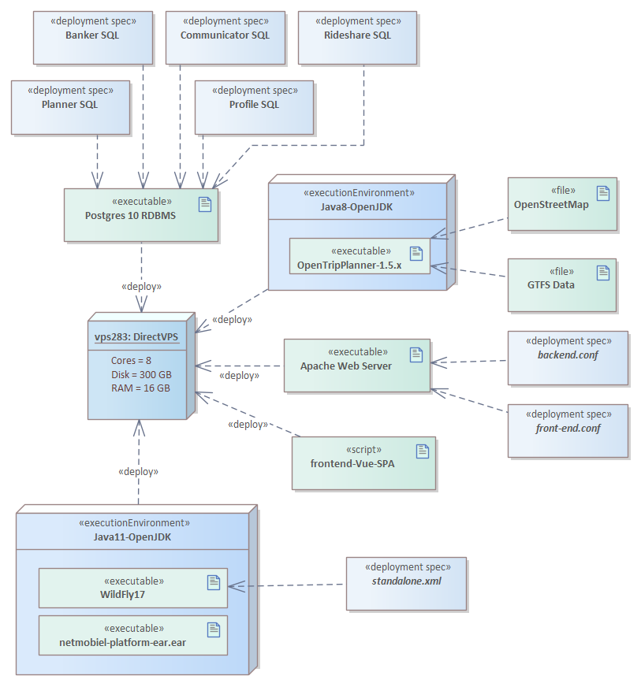

# Deployment
For the deployment of the production version of the Netmobiel platform (for the pilot) we used an old-school virtual private server, hosting all backend services. The setup is depicted below in the Deployment Diagram below:

The server required quite a lot of memory for the building the graph by OpenTripPlanner. In our case for The Netherlands we needed at least 12 GB.

