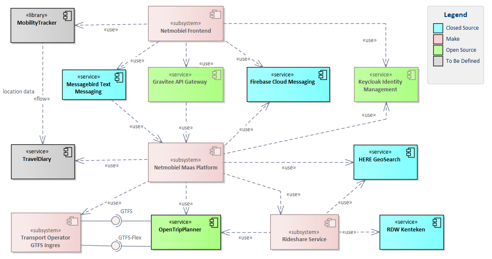
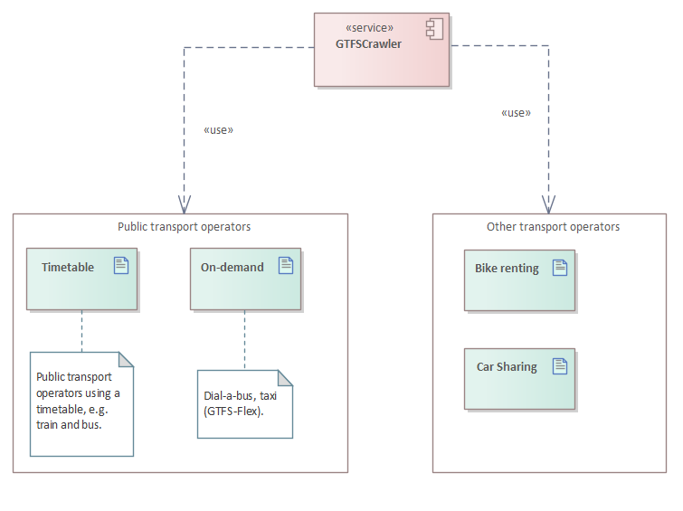

# Design

Below is the context diagram of the Netmobiel Platform.

The context diagram shows a number of subsystems:
* [The Maas platform](#backend): The backend of the Mobilty-as-a-Service system.
* [The Rideshare service](#backend): The carpool service developed in Netmobiel, it's own transport operator for sharing a ride by car. In the implementation the Maas platform and Rideshare service have been packaged together.
* [The Frontend application](#frontend): The front-end comprises of a large responsive webclient contained in very small app, both Android and iOS.
* [Mobility Providers GTFS Ingres](#gtfs-ingres): The periodic loading of timetables of public transport operators.

Netmobiel uses a few free or paid external services, in alphabetical order:
* API Gateway: Centralized access  for all client applications of the platform. This service is optional.
* Firebase Cloud Messaging: Text base message exchange for mobile devices (Apple and Android).
* HERE geolocation : For geolocating addresses.
* Keycloak security: Identity Management service, used for authentication of all users.
* Messagebird SMS: For sending text messages to mobile devices (paid service), mainly for authentication purposes.
* OpenTripPlanner: The route planner for road (modality car) and public transport.
* RDW License Plate registration: The Dutch registrar for the license plates of cars in The Netherlands, registering the details of each vehicle.

Two services/libraries have not been realized in the project:
* Travel Diary: The register of actual movements of the traveller, as reported by the Mobility Tracker.
* Mobility Tracker: A smart library for measuring the movements of the traveller, where the positions are already fitted to a street map or public transport routes.

## Backend
The platform backend is comprised of multiple services and client libraries. 

The services are is alphabetical order:
* [Banker](../netmobiel-banker-ejb/doc/design.md) - The credit and incentive management service, maintaining the financial position of each user.
* [Communicator](../netmobiel-communicator-ejb/doc/design.md) - The message service, using the internal chat feature, Google's Firebase Cloud Messaging and Messagebird SMS.
* [Profile Service](../netmobiel-profile-ejb/doc/design.md) - The profile management service, maintaining all user attributes.
* [Planner](../netmobiel-planner-ejb/doc/design.md) - The planning an trip managing service for the planning of a trip, using a multi-modal planner.
* [Rideshare](../netmobiel-rideshare-ejb/doc/design.md) - The carpool service, Netmobiel's own mobility provider (transport operator) for offering shared rides.

The backend is packaged as a single EAR, but the design follows more or less a microarchitecture (with a few TODOs left although). The frontend communicates with the platform through a REST API. 
This API is split over each service for easier handling. Each backend service has the same overall setup, see the following picture.

 

Each service has three subprojects: 
 * The EJB for the business logic (including database).
 * The REST implementation, including the (generated) mapping between domain objects and REST interface objects.
 * The OpenAPI specification. From the specification a JAX-RS interface and data transfer objects are generated. The OpenAPI specification plays therefore an important and central role.
 
Each external service, e.g. HERE or Firebase, is encapsulated in a library to limit the visibility of external interfaces as much as possible and to ease a migration to a different service provider, if necessary.

## Frontend
The front-end written for Netmobiel is in the project [Netmobiel Vue Client](../../netmobiel-vue-client/README.md). It is (mainly) a reactive HTML5 application written in Vue. For integration with the Firebase messaging a real app was required. For ease of development we used a [Flutter application](../../netmobiel-flutter-client/README.md) to have a single source and generate from there an Android as well as an iOS app. On desktop the webapplication can be used directly in a modern browser.

 

## GTFS Ingres
GTFS is the abbreviation of General Transit Feed Specification. GTFS defines a common format for public transportation schedules and associated geographic information. GTFS "feeds" let public transit agencies publish their transit data and developers write applications that consume that data in an interoperable way. See [GTFS.org](https://gtfs.org/) for more information.

 

For the pilot of Netmobiel the GTFS data of all the public transport operators in the Netherlands was periodically loaded by a script at some quiet time every sunday morning very early. Netmobiel does not support GTFS-Flex or data provided by Bike rentals or Shared Car rentals.

## Netmobiel and the TOMP API
Parallel to the development of Netmobiel the [TOMP](https://github.com/TOMP-WG/TOMP-API) initiative was underway to standardize the interface between a MaaS Platform and the Transport Operators. In Netmobiel a proof of concept has been developed to make the Rideshare service available as a TOMP Transport Operator service. Only the planning part is implemented.

The TOMP OpenApi specification is used in Netmobiel to create the Java interface together with all data transfer object types in the [netmobiel-tomp-api](../netmobiel-tomp-api) project. This interface is implemented by a separate [Rideshare Transport Operator](../netmobiel-rideshare-to) REST service. In the repository the service is not actually used. For more information about calling the api see the comments in this source file in the [Planner](../netmobiel-planner-ejb/src/main/java/eu/netmobiel/planner/service/Planner.java), method searchRideshareOnly().

