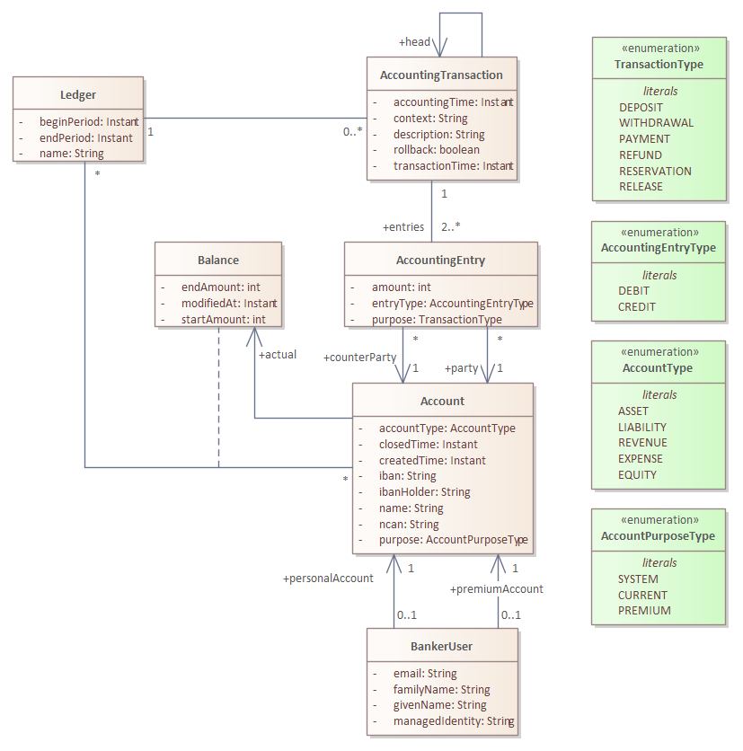
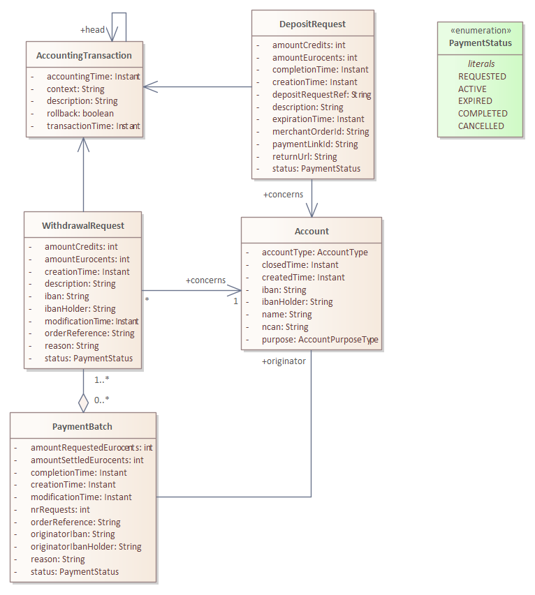
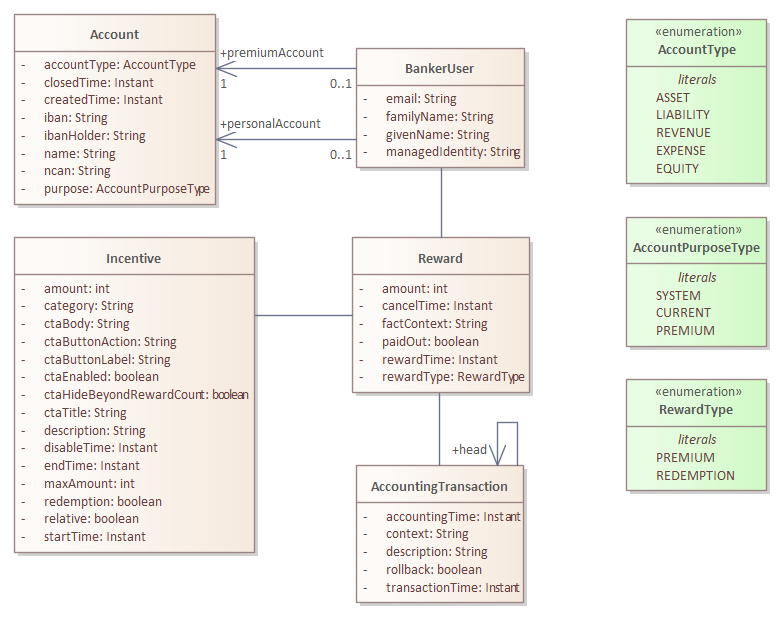

# Design
The banker service is composed of four parts: 
* The core financial administration, the transaction details;
* The deposit, withdrawal and payment batch administration;
* The charity and donation administration;
* The incentive and reward administration;

## Transactions
Following below is the class diagram of the core transaction administration. It is pretty straightforward, with the unavoidable exceptions.

 

* **BankerUser**: A synchronized copy of the user as registered in the Profile service. A user has a current account and a premium account. A premium account is used for incentives.
* **Account**: The bank account for a user or some other entity. Because an account can also be a issued to a charity, there is no navigable link to the banker user.
* **Ledger**: A simple ledger, collecting all balances and transactions over a certain period.
* **AccountingEntry**: A single statement for a particular account.
* **AccountingTransaction**: A complete transaction composed of at least two entries. The total sum is always zero as this is not the place to create credits out of thin air.
* **Balance**: Represents the current monetary state of an account. 

Transactions can be chained, each transaction in a chain shares the same head. If the head value is `null` then the transaction is the head. The chain is used to undo a transaction and to assure the proper reversal operation is used.

An accounting transaction has always a context. The context is a [urn](../../doc/design.md#identification-of-system-objects) referring to a specific Netmobiel object. It is a weak link that can be used to look up the exact reason for the transaction.

### Working Principle
Each account has an account type: 
* **Asset**: The account represents credits owned by Netmobiel. When credits are added (deposited) or removed (withdrawn) from Netmobiel the asset balance changes.
* **Liability**: The account represents credits owed to the account holder. 

Each account has also a purpose: 
* **System**: The account holder is the Netmobiel system. System account are created on system initialization.
* **Current**: The account is used for depositing, payments and withdrawals.
* **Premium**: The account is used to pay rewards as incentives. The system is the holder of the central **Premium** **Liability** account from where premiums are paid to the users of Netmobiel. The API has a method to deposit premium credits into the system, thus creating credits from this air as it seems. However, there must be an equal amount of real money have been deposited on the bank account of the party responsible for the exploitation of Netmobiel. The user cannot deposit to or withdraw from the account.

### Example Transaction Chain
Let's assume a traveller books a ride with someone. Let's also assume the traveller - soon to be passenger - has premium credits is his premium account, enough to pay for the whole trip. The business rule: trips with rideshare can be paid for the full amount with premium credits. What are the transactions, following the happy path?
* The user books a ride: Reserve the fare of premium credits. The reserved amount is moved to a central reservation account.
* The now passenger and driver agree at the end of the ride. A number of transaction are now atomically executed:
  - The premium credits are released, the premium credits return to the user's premium account.
  - The premium amount is transferred from the user's premium account to the user's current account.
  - The fare is transferred to the current account of the driver.

## Deposits, Withdrawals and Payment Batches
This diagram shows the elements involved in moving real money in and out Netmobiel. The transaction details part and the banker user are omitted.

User can deposit credits by buying them through iDeal payment. 

A DepositRequest captures the conversation between NetMobiel and an external payment provider, used by the BankerUser to deposit credits in his Account. The credits are paid in euro's.

A WithdrawalRequest models the reverse operation where a BankerUser wants to exchange his Netmobiel credits for euro's. WithdrawalRequests are collected in a PaymentBatch. From the PaymentBatch a so called [SEPA Credit Transfer File](https://www.abnamro.nl/en/commercialbanking/products/payments/sepa/credit-transfer/index.html) is created and downloaded by the treasurer of Netmobiel. Each credit transfer file is processed (manually) by the treasurer. Once the treasurer has executed the transfer, the payment status of each withdrawal request must be updated in Netmobiel, i.e. confrimed or cancelled. Only then the withdrawal is completed in Netmobiel.

Summarized: Any user can initiate a deposit request, but a withdrawal is only a request. The actual execution is performed by the treasurer, the owner of the bank account of Netmobiel.

## Charities and Donations
Netmobiel supports donations of credits to local charity organizations that have been approved by the treasurer or administrator of Netmobiel. The model is depicted below.

A Charity is managed by the treasurer, the administrator or a user that has been given the CharityUserRole `Manager`. The manager can see all the account details (current balance) of a charity. Ordinary users only see public information.

## Incentives and Rewards
Netmobiel has defined an incentive model to stimulate desired behaviour, for example carpooling. A rule in Netmobiel during the pilot has been to reward a driver when he or she has offered a certain amount of rides in some period of time. The incentives don't drop out of the blue sky of course, so that is where the premium budget is used for. The general mechanism of rewarding someone is:
1. A user has earned a reward for something.
1. The reward is issued to that user.
1. If there is enough budget, the user is finacially rewarded, usiung his/her premium account.

The design of the incentives is state-based, as opposite to event-based. By this we mean that periodically the incentive rules are evaluated. That evaluation might lead to a hand out of a reward. Equally, a reward might also taken back if it was handed out mistakenly or for some other reason. With this mechanism it is easy to create new  incentives that can be put in operation with a specified look-back period.

A reward can be of two types:
* **Premium Reward**: This reward will increase the amount of premium credits of a user, at the expense of the premium budget (a system account). Of course this will fail when the system premium balance is empty. The reward will stay, perhaps later on more budget will be assigned and then the rewards are paid out after all.
* **Redemption Reward**: A redemption reward is a reward that transfers premium credits from a user to his current account. If a user has no premium credits, then the user does not get anything.

 A reward has a `factContext` field. This field contains the URN of the system object that initiated the reward. In combination with the incentive the system can track the origin exactly.

