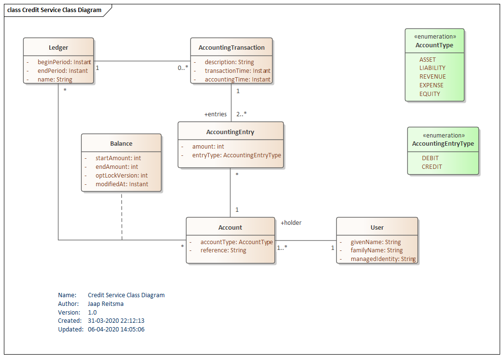

# Design

The banker service is composed of four parts: 
* The core financial administration, the transaction details.;
* The deposit, withdrawal and payment batch administration;
* The charity and donation administration;
* The incentive and reward administration;

## Transactions

rather compact. See the class diagram for the architecture, showing most relevant classes.

 

## Deposits, Withdrawals and Payment Batches

## Charities and Donations

## Incentives and Rewards
