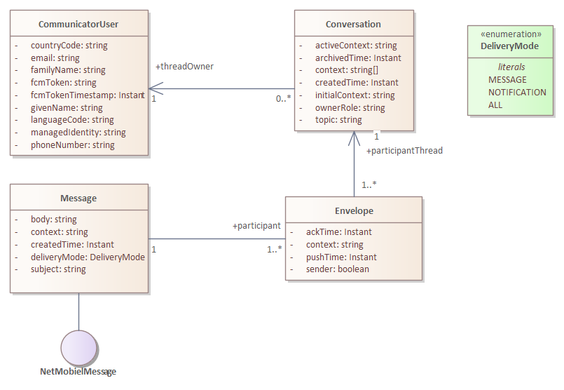

# Design

The Communicator realizes a simple conversation based chat mechanism. A chat is centred around a specific topic. 

A conversation is started with a topic and a specific unique initial context. A context is a [urn](../../doc/design.md#identification-of-system-objects) referring to a specific Netmobiel object. It is a weak link that can be used to look up the conversation related to that context. A Conversation has one or more contexts assigned, because during the process of chatting between users, new system objects are (probably) created.

A Message has one or more Envelopes. A system message (generated by some system event) has no sender envelop, but real users have always their own envelope. The context assigned to the envelope is the context relevant for the specific participant. The context of the message is the system object that caused the creation of the message. All context are always added to the conversation of each envelope.

It is noteworthy to realize that each participant has its own conversation, but that messages are shared between the conversations through the envelopes. In a simple two participant conversation, the two conversations are each others mirror. With more participants the resulting view is complex as some messages are private between two participants and not visible for other participants, while other messages have a wider visibility.

A message can be a push notification (on a mobile phone), or a simple message (in the user interface a kind of inbox). All messages are stored in the database. When a message is read by a participant, the envelope of the participant is acknowledged.

Notification messages are pushed to the mobile phone using Firebase Cloud Messaging (FCM). The token required by the FCM is stored by the CommunicatorUser.