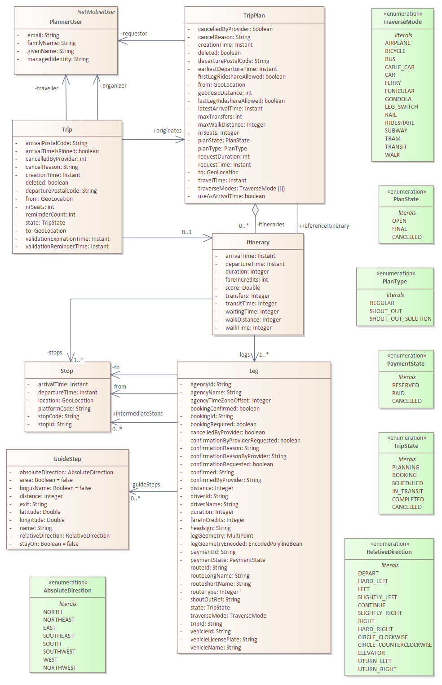
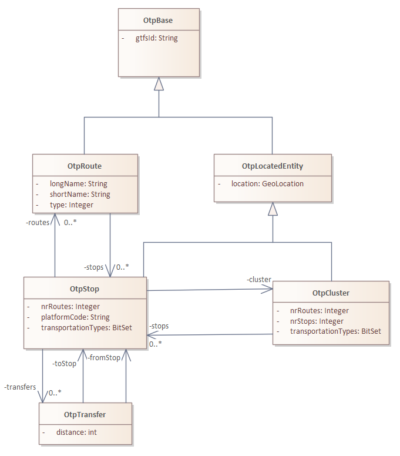
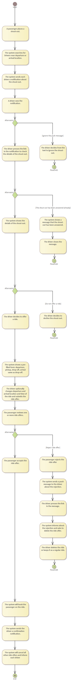

# Design
The Planner is the functional core of the MaaS platform. It handles all the trip related functions:
* Searching: Multi-modal trip planning, on top of OpenTripPlanner
* [Booking](trip-booking.md): Handle the booking (low-level) process.
* Management: Store and retrieve trip plans and trips.
* [Monitoring](trip-monitoring.md): Follow the progress of a trip.

The Planner is using OpenTripPlanner (OTP) for the actual planning of public transport or car itineraries. 

## Planner Algorithm
The Planner uses OTP for planning the regular trips: Trips involving public transport or car, both exclusively. Public transport could be seen as multi-modal because of the combination of bus and train, but in Netmobiel multi-modal means the combination of public transport with others means of transport in a single trip, like train and car (as in rideshare). The combination of public transport and rideshare is not calculated inside OTP. We considered [GTFS-Flex](https://trid.trb.org/view/1858112), but in 2018 this specification was just in its infancy and support in OTP 1.4 was still limited. 

We did not consider to extend OTP ourselves, because OTP is a sophisticated piece of solid engineering and good understanding of the internals is a prerequisite for making changes. Our resources were too limited to undertake such a task. Instead, the planner service a doing the combinatoric work, applying some heuristics to limit the required calculations.

Note: As of writing this in 2022, the white paper on [GTFS-Flex](https://trid.trb.org/view/1858112) mentions rideshare as one of the use cases, so perhaps some research should be done to investigate the depth of integration of ridesharing in OTP with GTFS-Flex.

The Planner in Netmobiel, targeting people living in rural areas, considers the following use cases:
1. A complete trip by car as a passenger, riding along with someone, a trip with a single modality.
2. A trip largely using public transport, but using rideshare as first or last leg, a true multi-modal trip. This is in fact an extension of the first use case.

A multi-leg itinerary involving multiple cars is not considered. The distances in the Netherlands are relatively small, in case of the targeted pilot area the maximum distance would be around 50 kilometer. People are in general not inclined to switch cars on their trips. 

Both use case have in common that a route needs to be calculated for the pickup and drop-off of the prospective passenger, given the initial origin and destination of the driver.

The first case uses the search algorithm of the Rideshare service to find potential rides. For each potential ride the planner calculates the new route including the passenger and verifies whether the trip fits the driver's conditions on maximum detour. The itinerary is assigned a score primarily based on the shift in actual departure time compared with the requested departure time of the passenger.

The second use case involves true multi-modal itinerary by combining public transport and rideshare. The algorithm first calculates an itinerary using only public transport (using a very large maximum walking distance for walking up to the nearest bus or train stop). The stops are collected. More stops, if necessary, are added by looking up the stops in the larger clusters that are found in the vicinity of the trajectory of the passenger. The vicinity is expressed as an ellipse, as explained in the paper by Massoud[^1].  Only clusters in the ellipse that are large enough (have a number of routes above a threshold) are considered. For a bit of background see also the explanation in the [Rideshare Service design description](../../netmobiel-rideshare-ejb/doc/design.md).

For each stop a numbers of calculations are made:
* Are there any rides that could drop-off the passenger to the public transport stop?
* Are there any rides that could pickup the passenger from the public transport stop?

The next step is calculate for each potential matching ride the complete itinerary. Only rides acceptable for the driver are kept.

The final step is to assign a score to all itineraries. The score is based on:
* The matching of the travel time of the passenger (closer is better);
* The number of transfers (less is better);
* The total door-to-door duration of the trip, compared with the fasted route by car (shorter is better);
* The total waiting time between successive legs (less is better);
* The total walking distance (less is better)

## Planner Class Diagram

The Planner domain model is shown below. It is rather conscise and straightforward:
* **TripPlan**: A regular search leads to the creation of a trip plan. Besides a copy of the search parameters, the trip plan comprises of a number of itineraries. Each itinerary has a score assigned. A *shout-out* is a particular type of plan in the sense that itineraries can be added over time by prospective rideshare drivers.
* **Trip**: A trip is the materialized result of a selected itinerary from a trip plan.
* **Itinerary**: An itinerary is a collection of legs to travel from departure to arrival.
* **Leg**: A leg is the description of the a displacement using a single mode of transport between a boarding and an alighting.
* **Stop**: A stop is the description of the place for boarding and alighting.
* **GuideStep**: A GuideStep is a description for the traveller in case of the Walking modality. Available in OTP, but currently not used by Netmobiel.
* **PlannerUser**: A synchronized copy of the user (from the Profile Service).

## Public Transport Model
For finding potential stops for car to public transport of vice versa, we make a copy the public transport graph in OpenTripPlanner. The copy is regularly updated by a scheduled refresh operation. For obvious reasons, the refresh must be timed after finishing the update of OTP.

## Shout-Out Plan
The Planner Service supports an innovative type of trip plan: The Shout-Out. A shout-out is basically a request for a ride. The shout-out is implemented as a trip plan that has not completed yet. Drivers can propose a ride by submitting a driver trip plan. The traveller can confirm one of the offered rides, thereby automatically cancelling the remaining proposals. From then on the trip plan has completed and is closed. The shout-out comprises of many steps and paths, see the activity graph below.

[^1]: A real-time algorithm to solve the peer-to-peer ride-matching problem in a flexible ridesharing system, Neda Massoud, R. Jayakrishnan, Transportation Research Part B 106 (2017) 218-236.