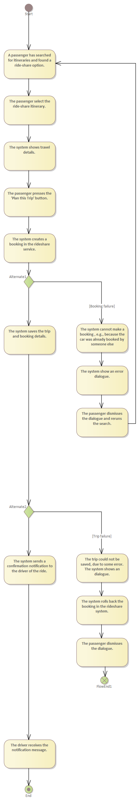
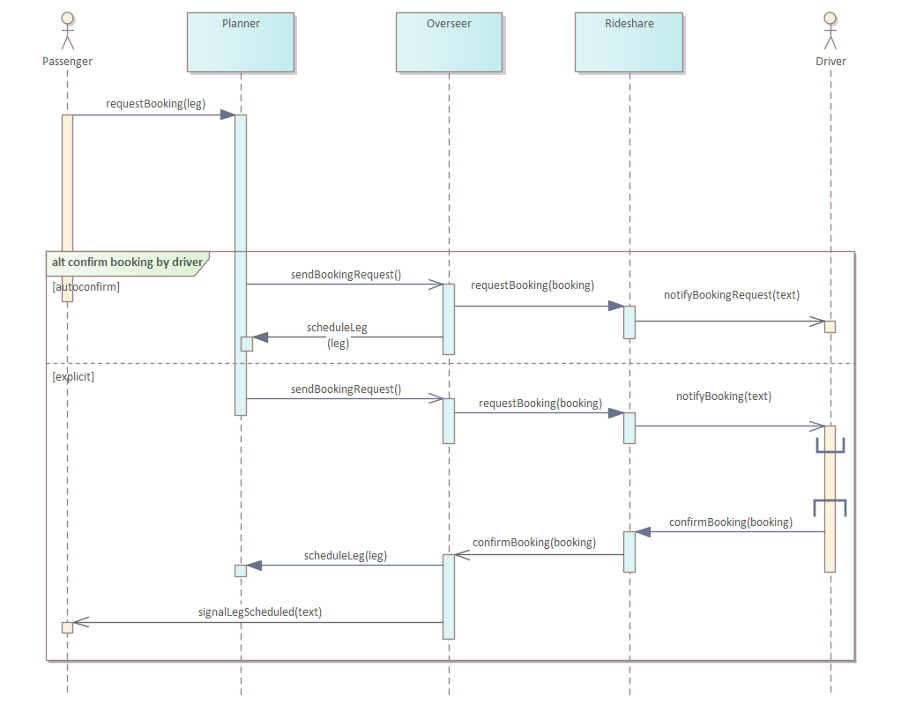
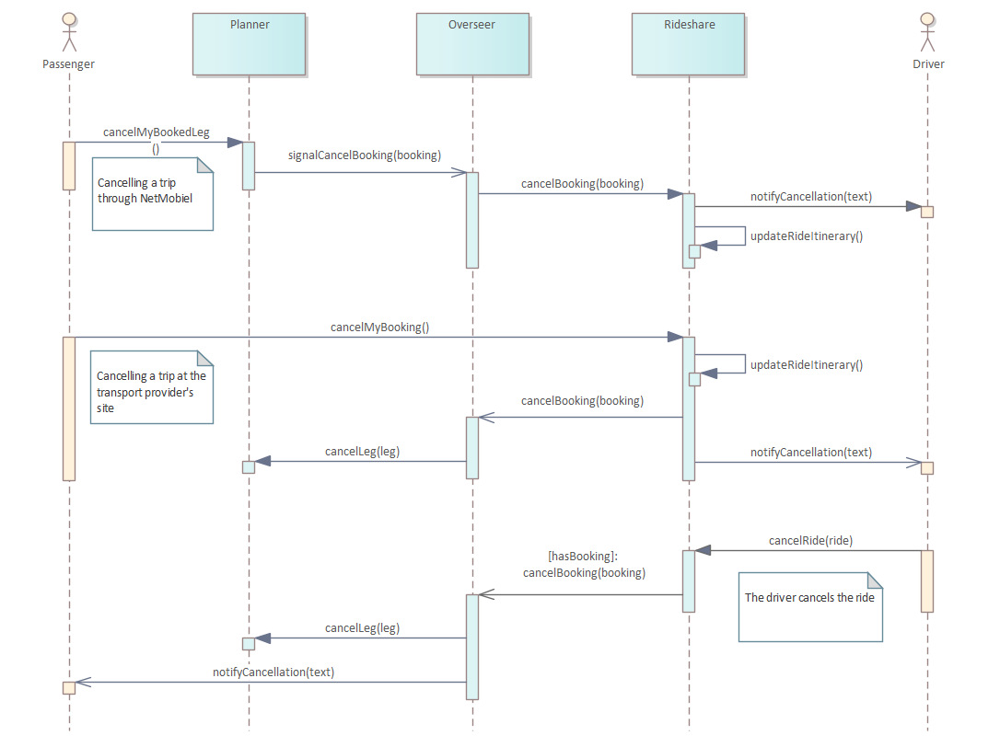
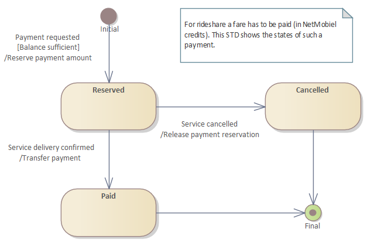

# Trip Booking

[Back to Design](./design.md)

## Booking Process
The Planner Service initiates the booking, if necessary. Currently only the Rideshare Service rides require a booking. The booking process comprises a rather long list of activities, as shown below. 

The booking process involves also other services like the [Overseer Service](../../netmobiel-overseer-ejb/doc/design.md) and the [Rideshare Service](../../netmobiel-rideshare-ejb/doc/design.md). The sequence diagrams below show the interaction between the services.

Note that the diagram shows alternate paths: The case of an automatically confirmed booking and the case of an explicitly confirmed booking.

To cancel a booking the following sequence of calls apply. 

This SD shows three possible flows for cancelling a booking:
1. Cancel booking by passenger in Netmobiel App.
2. Cancel booking by passenger in mobility provider's app
3. Cancel booking by mobility provider, e.g., the rideshare driver.

## Fare Payment
For a booking to be successful, a far emust be paid, or more precise, reserved. The following diagram shows the state transition diagram of a fare payment.

