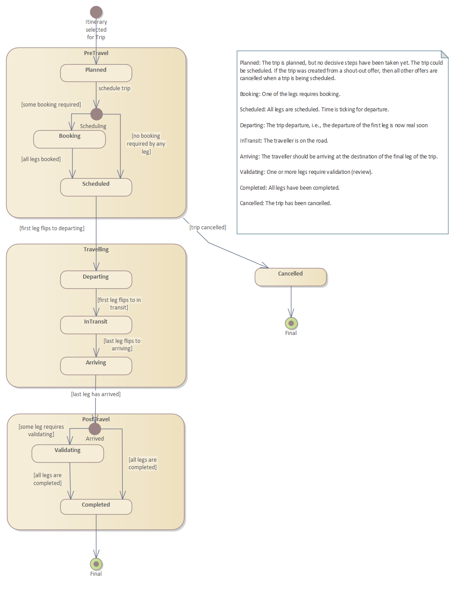
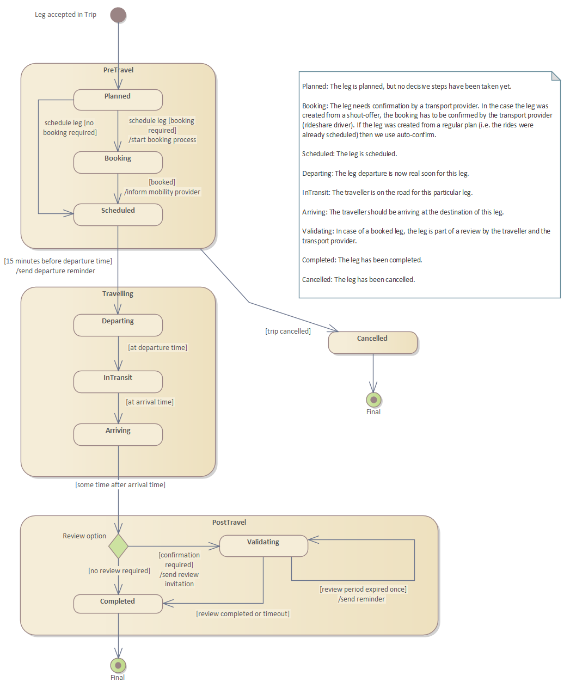
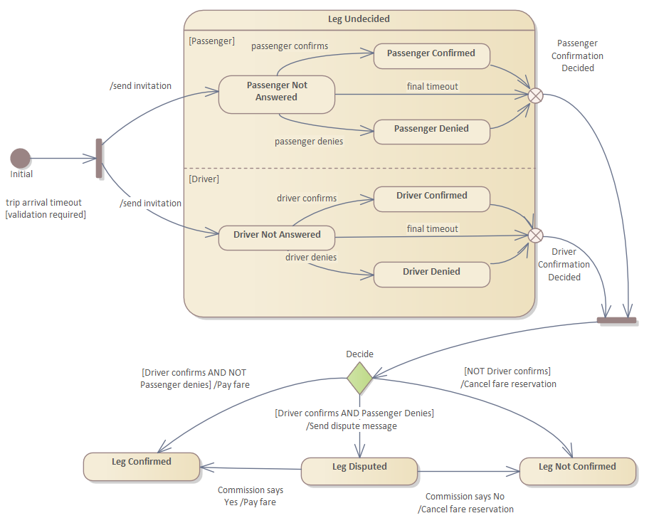

# Trip Monitoring

[Back to Design](./design.md)

The Planner Service is monitoring the progress of a trip. A Trip has a state, this state is basically derived form the state of its constituting legs. The following State Transition Diagrams show relationship:

The STD of the Leg is similar, but has no decision points. 

In Netmobiel the Rideshare Service fares are paid used Netmobiel credits. For correct payments, a few rules apply. These rules lead to the state transition diagram below:

The process is quite complex. The picture does not include the reminders sent to the driver and passenger. Also omitted is the reconsideration step. Both driver and passenger can roll-back their own decision after the validation, but only if that step is to their disadvantage. E.g., a driver can roll-back the validation if the payment of the fare was unjustified.