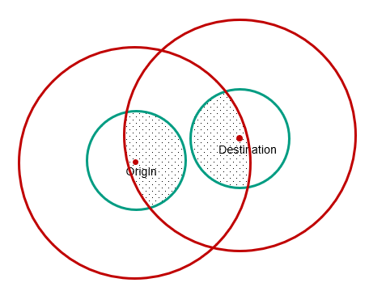

# Design
The Profile Service manages the personal data of the Netmobiel user. For ease of use each of the other services (most) have a synchronized subset of the profile. The exception is the communicator: Communicator-specific settings are stored by the communicator only. 

## Core Profile Management
Following below is the class diagram of the core of the Profile service.

Noteworthy to mention is the visible combination of the Passenger settings and the Rideshare driver settings. In Netmobiel, in particular in the frontend, are the user interfaces for the two roles combined in a single application. 

During the registration of a new user, the family name, given name and email address are copied from the token issued by Keycloak.

## Finding a driver for a shout-out
The profile service has a method to lookup the drivers that might be eligable to respond to a shout-out of a traveller. The algorithm does a geographical search based on the home location of the driver and the requested departure and destination locations of the traveller. To limit the number of shout-out notifications, an algorithm is designed to reach out only to the most promising drivers.  A driver gets a notification about a shout-out under the following conditions:
* We want the driver to live near the departure or destination location of the passenger. Currently set as a circle with radius of 20 kilometers (actually should much less). The reason for this limit is to reach-out only to drivers that might live in the same community as the origin or destination of the traveller.
* We want the driver to be reasonably near both the departure or destination location of the passenger. The current implementation uses two large circles of 50 kilometers. The reason for this limitation is to exclude shout-outs for long-distance trips.

The picture below demonstrates the result of the intersections: Only drivers living in either shaded area receive a notification.

The algorithm is a bit of a guess, testing on a (large) dataset is needed to validate the selection algoithm..

## Reviews and Compliments

Netmobiel supports a review and compliment mechanism. As Netmobiel is targeted at rural area with small communities, this mechanism is biased in positive direction. The system wants the user to given compliments, no negative things as a quarrel is easily started. The review text is free, there is no check on the content.

## Delegation
Netmobiel supports delegation, where someone can ask an informal carer to do the planning and searching for that person. The user who wants to become a carer of someone should first ask the Netmobiel administrator to assign the role `delegate`. The carer can then search for the profile or create a new profile for his client  and start the process to become a delegate. This process involves obtaining an activation code from the prospected carer client, the delegator.

## Surveys
To research purposes, a feature has been added to redirect users to an external survey provider. On startup of the frontend application, it will ask the backend for any survey to take. If the proper conditions are met, the response will be non-empty. The frontewnd will then perform a redirect to the survey provider. Currently only [Qualtrics](https://www.qualtrics.com) is supported.

## Logging of User Sessions
To investigate the usage of the application a simple DIY session logging has been added. It is simple and it's doing the job.  

The abbreviation CTA stands for call to action.

