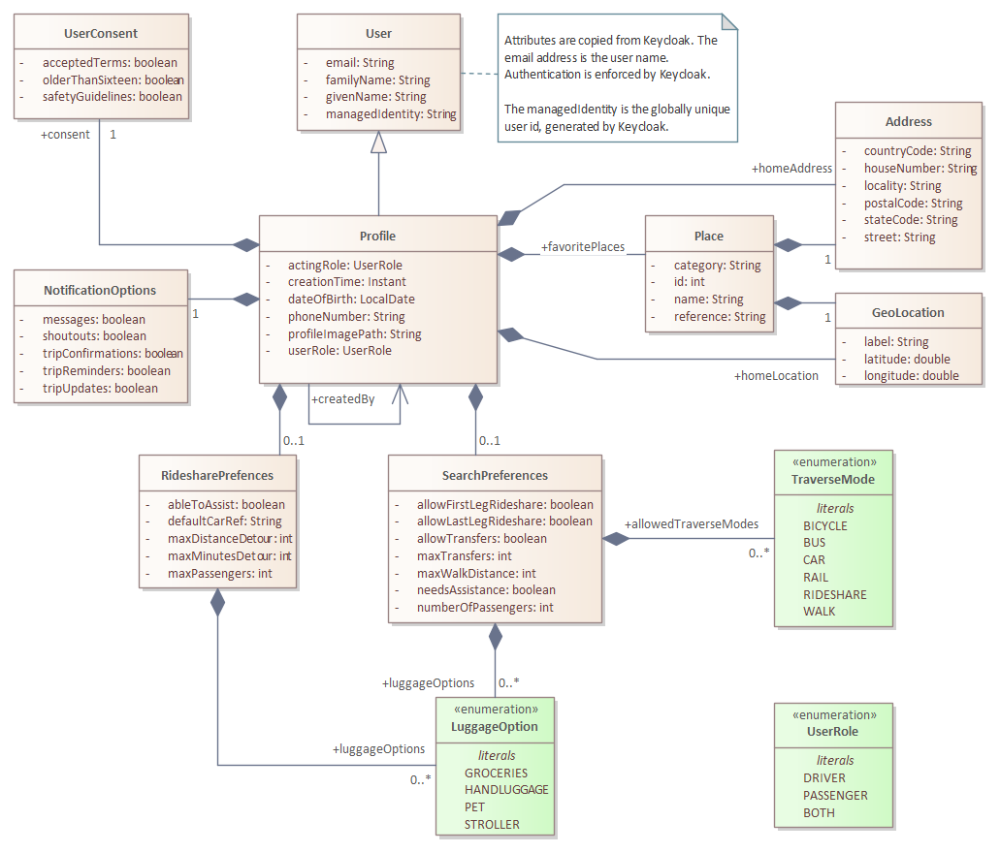
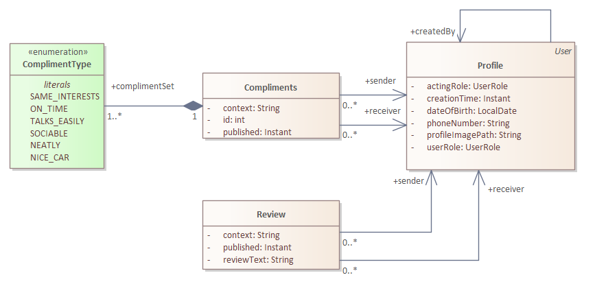
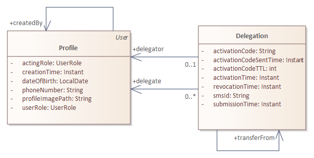
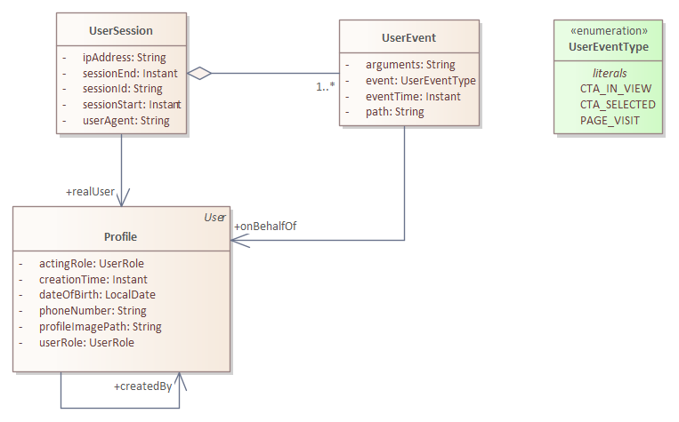
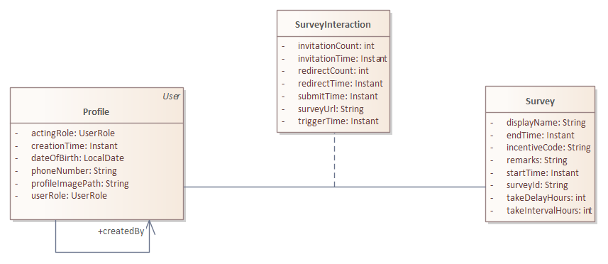

# Design

The Profile Service manages the personal data of the Netmobiel user. For ease of use each of the other services (most) have a synchronized subset of the profile. The exception is the communicator: Communicator-specific settings are stored by the communicator only. 

## Core Profile Management
Following below is the overall class diagram of the Profile service.

## Reviews and Compliments

## Delegation

## Logging of User Sessions

## Surveys

