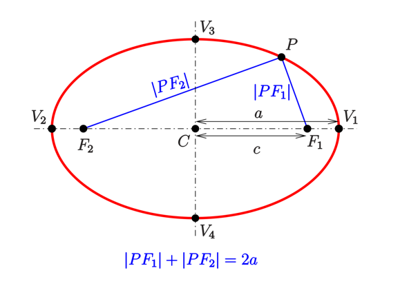
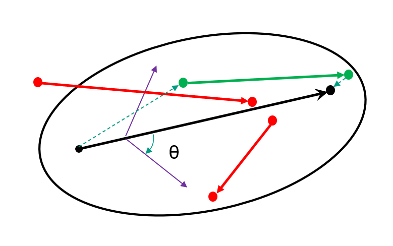
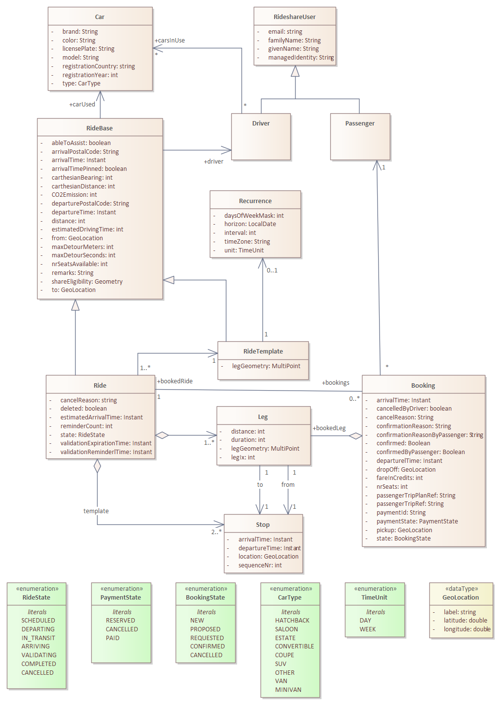
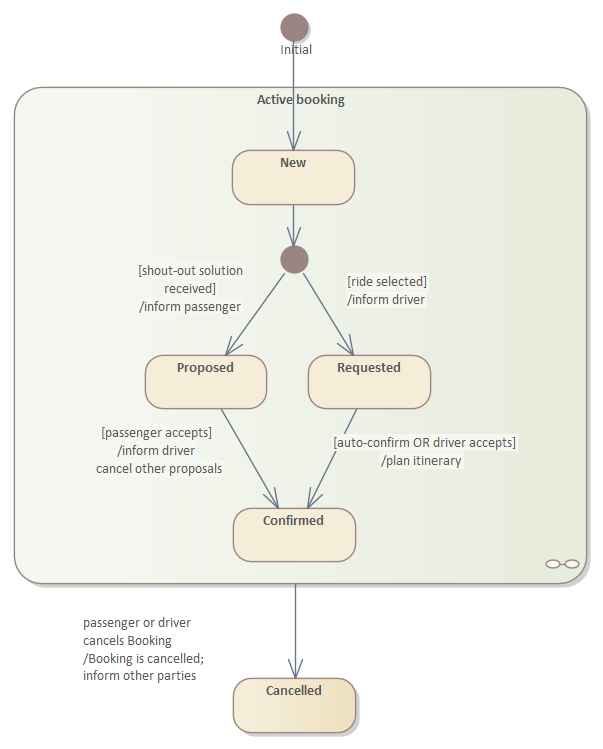

# Design

Rideshare is a small service for managing rides by car, with the purpose to find passengers, or better: To give passenger the possibility to find a ride that fits the intended itinerary. Below is the algorithm for finding a ride explained. In addition the class diagram of the domain of Rideshare is depicted as well as the state transition diagram of a ride.

## Rideshare Ride Eligibility Algorithm

The search for a matching ride has some obstacles. The traveller (the potential passenger) knows the location of his departure and arrival, and also knows either time of departure or arrival. However, both time and place are not written in stone. Perhaps a few hundered meters further or a hour later would do as well. We do no know the precise intention of the traveller. The search for rides must therefore be a bit flexible and also find rides that are less optional (for the traveller). On the other hand, the driver might be inclined to make a longer detour for someone from his own community than for a stranger.

Ideally an integration should be made with OpenTripPlanner, for instance using [GTFS-Flex](https://github.com/MobilityData/gtfs-flex). At the time of the design, it was not clear how to pull this off with such a dynamic system as a Rideshare service where stops (for pickup and drop-off) are not known beforehand. We created our own approach, in part based on existing research. One of the ideas we used was describes in a paper about ride-matching in a flexible ridesharing system[^1]. 

The first step in matching is to create a (short) list of rides that might be a match. The method proposed in the paper was called *Ellipsoid Spatiotemperal Accessibility Method*  (ESTAM). The idea is to create an [ellipse](https://en.wikipedia.org/wiki/Ellipse) around the driver's ride (as the crow flies) with the driver's departure and arrival locations in the focal points of the ellipse. An ellipse has the interesting geometrical feature that the total distance from one focal point to some point on the the circumference and then to the other focal point is a constant value, as shown in the following picture[^2].

Given the detour that a driver is willing to make and given both departure and arrival locations (as the crow flies), an ellipse can drawn. This ellipse is calculated once when the driver submits a ride and stored in the database.

The spatial query is now to find all rides with an ellipse that contains both departure and arrival location of the traveller. To avoid the case where driver and upcoming passenger travel in opposite directions, an additional condition is added that both should travel in about the same direction. The current setting is the angle (theta in the picture below) between the two travel vectors should not exceed the 60 degrees. We loose some rides in edge conditions, especially with relative short trips, but for now it will do. The principle is shown in the picture below.

The driver's vector is the black one. The other dot-arrow vectors represent various travellers. The driver's ride is eligible for the the green ones, because they are within the ellipse. This ride would be skipped when searching given one of the red vectors, either because the vector is (partly) outside the ellipse or because the desired direction does not match.

Additional conditions apply before a ride is a possible match:
* The temporal window must match close enough. The algorithm uses an *earliestDeparture* and *latestArrival* parameter to filter the rides.
* The car should have enough seats (a booking might imply multiple seats)
* The ride must not already have a booking. Theoretically multiple bookings for a single ride are possible, but it gives a lot of trouble in handling, administration and communication (just as in real life). For now the limit was set to one at most.

The list of potential rides is handed off to the planner for closer evaluation, e.g. using the real distances instead of as-the-crow-flies.

## Rideshare Class Diagram
See the class diagram for the architecture of the rideshare service, showing most relevant classes.

 

To support recurrent rides a templating mechanism has been design. For the calculation of the itinerary of the ride the OpenTripPlanner (OTP) service is used. To avoid the recalculation of each instantiated ride, the leg geometry (a ride comprises a single leg) is stored in the template. The instantiated ride is then completely calculated from the template. Note: If OTP would support a dynamic planning algorithm (i.e., considering external conditions like traffic), this approach obviously cannot be used anymore.

The model assigns a car to a driver. Note that although the entity is called *Car*, the semantics is closer to *CarUsage*. The car itself is not of much interest, the same car might even exist multiple times in the database, once for each driver. The important part is the usage of the car by a driver and the number of seats. Other attributes are added for the passenger to be able to recognize the car at the moment it arrives for pickup.

Currently a ride can have at most one booking. Cancelled bookings are ignored. A ride with a booking has one, two or three legs, depending on the pickup and drop-off location of the passenger.

## Ride State Transitions
The Rideshare service monitors each ride. In absence of a real-time measurement of the driver's actual location, the service monitors the theoretical progress by observing the itinerary. The state transitions are depicted in the next State Transition Diagram (STD).

 

## Rideshare Booking
A booking is created when a passenger accepts a ride from the itinerary search page, or when the passenger accepts the offer of a driver in response to a shout-out. In the current implementation, a requested booking is automatically confirmed without interaction with the driver.

[^1]: A real-time algorithm to solve the peer-to-peer ride-matching problem in a flexible ridesharing system, Neda Massoud, R. Jayakrishnan, Transportation Research Part B 106 (2017) 218-236.
[^2]: Picture by Ag2gaeh, source: https://en.wikipedia.org/wiki/Ellipse